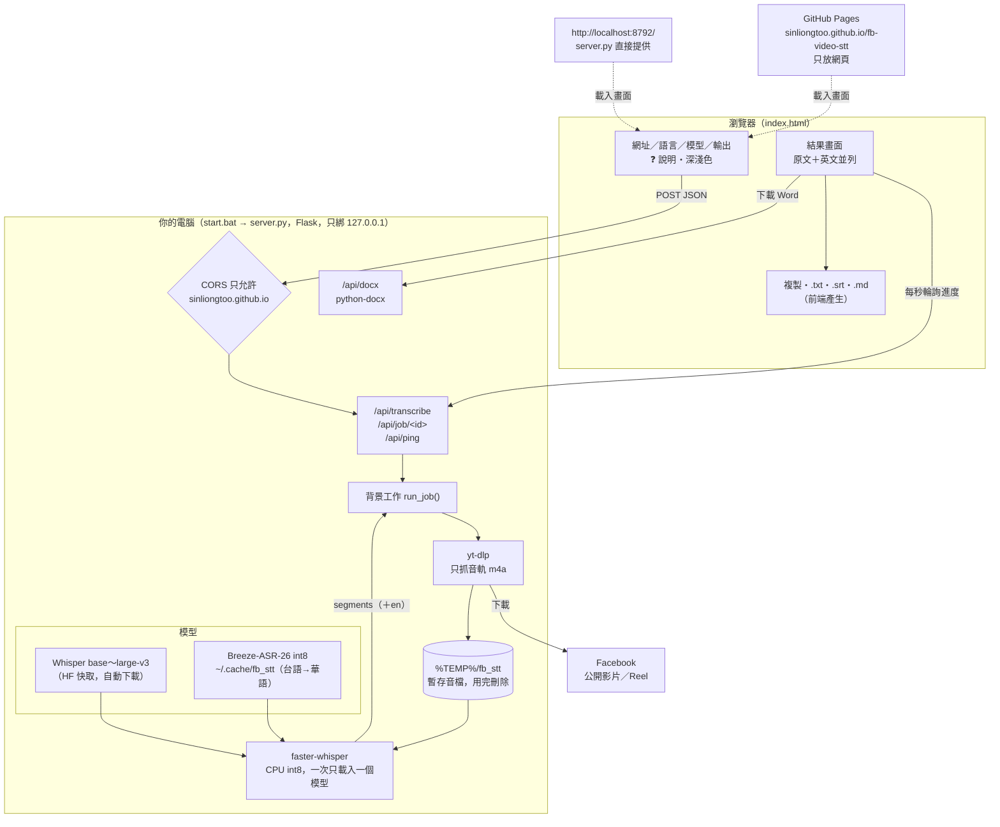
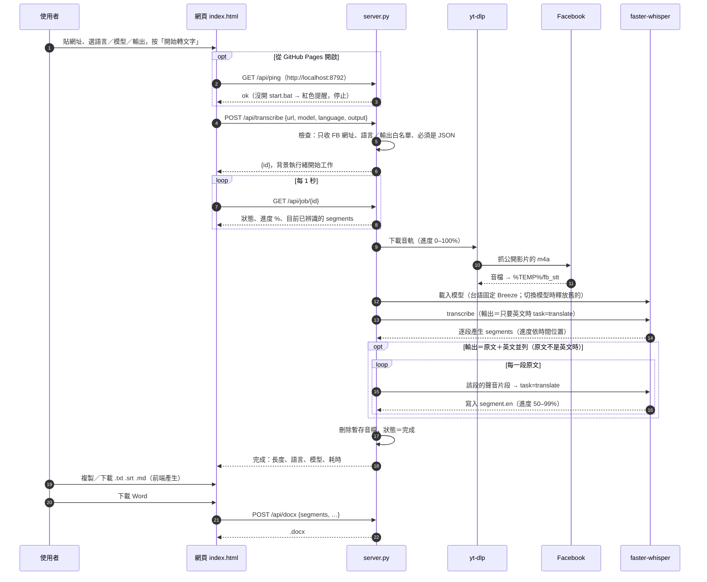
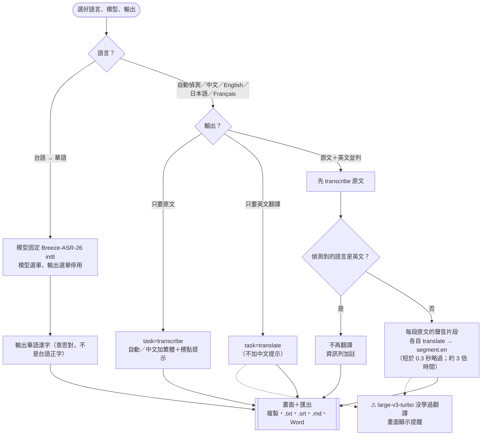

# FB 影片轉文字（FB video → 逐字稿）

貼上 Facebook 影片／Reel 網址，在**自己的電腦上**把語音辨識成文字，可以複製或下載成 .txt／.srt／.md／Word，
也可以翻成英文或原文＋英文並列。
音檔不會送到任何第三方服務（只有 yt-dlp 去 Facebook 抓公開影片的音軌）。

- 線上版網頁：**https://sinliongtoo.github.io/fb-video-stt/** （仍需在自己電腦上開 `start.bat`，見下方）
- 原始碼：https://github.com/SinLiongToo/fb-video-stt

## 安裝（新電腦第一次）

```bash
git clone https://github.com/SinLiongToo/fb-video-stt.git
cd fb-video-stt
pip install -r requirements.txt
```

需要 Python 3.10 以上。台語選項另外要下載模型，見「台語模型」。

## 使用方式

1. 雙擊 `start.bat`（或在這個資料夾執行 `python server.py`）
2. 瀏覽器開 **http://localhost:8792/**（start.bat 會自動開），或開線上版
3. 貼上網址 → 選語言、輸出方式 → 按「開始轉文字」
4. 完成後可：勾/不勾「顯示時間碼」、複製、下載 .txt／.srt（字幕）／.md／Word

> 直接雙擊 `index.html` 不能用：瀏覽器本身沒辦法抓 FB 影片（CORS），一定要透過 `server.py`。

### 線上版（GitHub Pages）怎麼運作

GitHub Pages 只能放靜態網頁，**不能執行 Python**，所以線上版只是畫面：
網頁偵測到自己在 `*.github.io` 上時，會改把請求送到 `http://localhost:8792`，也就是你自己電腦上的 `server.py`。

- 沒開 `start.bat` → 頁面顯示紅色提醒，按「開始」也會提示先開伺服器。
- `server.py` 的 CORS **只允許** `https://sinliongtoo.github.io` 這個來源，別的網站的 JS 不能操作你的本機伺服器；
  API 也只收 `application/json`，擋掉跨站的純文字表單偷送請求。
- Chrome／Edge 可用（第一次可能詢問「允許存取本機網路裝置」）。Safari 會擋 https 網頁連 http://localhost，請改開本機網址。
- 改了程式之後：本機版重新整理即可；線上版要 `git push` 後等 GitHub Pages 重新部署（約 1 分鐘）。

### 語言選項怎麼選

| 選項 | 用在哪 | 備註 |
|---|---|---|
| 自動偵測（預設） | 不確定、英文、日文、華語 | **不要對英文影片選「中文」**：Whisper 會把英文直接「翻譯」成錯誤很多的中文（實測過） |
| 中文（繁體） | 確定是華語的影片 | 會引導輸出繁體＋標點 |
| English／日本語／Français | 確定是該語言時手動指定 | 避免短影片自動偵測判錯 |
| 輸出：只要英文翻譯 | 想直接要英文 | 只能翻成英文；large-v3-turbo 不會翻譯；台語模式不適用 |
| 輸出：原文＋英文並列 | 想對照原文與英文 | 每句原文下接一行英文；時間約 3 倍 |
| 台語 → 華語（實驗性） | 台語影片 | 用 Breeze-ASR-26。**聽得懂台語，但輸出華語漢字**，不是台語正字。詳見下方「台語模型」 |

模型選單（base／small／medium／large-v3-turbo／large-v3）只影響非台語選項；越大越準、越慢。
這台電腦沒有 GPU，建議 small。

## 檔案

| 檔案 | 用途 |
|---|---|
| `index.html` | 網頁介面（無外部依賴，深色／淺色模式） |
| `server.py` | 本機 Flask 伺服器：yt-dlp 下載音軌 → faster-whisper 辨識；Word 匯出 |
| `start.bat` | 一鍵啟動並開瀏覽器 |
| `requirements.txt` | Python 套件清單 |
| `.nojekyll` | 讓 GitHub Pages 原樣提供檔案（必須是空檔） |
| `docs/architecture-*.mmd`／`.svg` | 架構圖原始碼與預先產生的 SVG（見「架構圖」） |
| `.claude/skills/run-fb-stt/SKILL.md` | 給 Claude 用的「怎麼啟動／測試這個工具」說明 |

## 架構圖

下面三張圖用 GitHub 原生支援的 Mermaid 語法畫，在 GitHub 上開 README 會自動顯示成圖。
同樣的圖也有預先產生好的 SVG，放在 [docs/](docs)，不用連網、Markdown 工具不支援 Mermaid 時也能直接用瀏覽器開：
[architecture-overview.svg](docs/architecture-overview.svg)、[architecture-job.svg](docs/architecture-job.svg)、[architecture-modes.svg](docs/architecture-modes.svg)。

**圖的原始碼是 `docs/*.mmd`**，README 裡的圖是從那裡複製來的。改圖時改 `.mmd`，再重新產生 SVG 並更新 README 這一節：

```bash
npx @mermaid-js/mermaid-cli -i docs/architecture-overview.mmd -o docs/architecture-overview.svg -b white
```

### 1. 整體架構

網頁可以從本機或 GitHub Pages 開，但下載與辨識一律在你自己的電腦上跑。



### 2. 一次轉文字的流程



### 3. 語言與輸出選項決定怎麼跑



## 環境需求

Windows、Python 3.12，套件：`flask`、`yt-dlp`、`faster-whisper`、`python-docx`（見 `requirements.txt`）。
不需要另外裝 ffmpeg（只抓 m4a 音軌，faster-whisper 內建的 PyAV 就能解碼）。

## 台語模型

### 安裝（只要一次）

台語選項需要 Breeze-ASR-26 的 **CTranslate2 int8** 版本（約 1.6GB），放在 OneDrive 外面避免同步：

```bash
python -c "from huggingface_hub import snapshot_download; import os; snapshot_download('phate334/Breeze-ASR-26-int8-CT2', local_dir=os.path.expanduser('~/.cache/fb_stt/breeze-asr-26-ct2-int8'))"
```

位置：`%USERPROFILE%\.cache\fb_stt\breeze-asr-26-ct2-int8`（可用環境變數 `FB_STT_TAIGI_MODEL` 改路徑）。
這份是第三方轉換的，但已確認來源 revision `7b992682…` 跟本機快取的官方 Breeze-ASR-26 一致，授權 Apache-2.0；
`model.bin` 是 CTranslate2 純權重格式，不是會執行程式碼的 pickle。

### 為什麼是 Breeze，而且只能輸出華語？（2026-10-04 實測紀錄）

測試影片：https://www.facebook.com/reel/29026250636981104 （61 秒台語戲劇對白，有背景音樂；
貼文本身附了台語漢字對白，可當參考答案）

| 方式 | 結果 | 耗時（CPU） |
|---|---|---|
| 一般 Whisper small（語言 zh） | 變成**不相干的華語句子**（「現在有很多藝人，人都認錯了…」） | 35 秒 |
| NUTN-KWS Whisper-Taiwanese v0.5（transformers 原版） | 只剩一句錯的：「心肝寶貝我早上還沒吃過…」 | 131 秒 |
| NUTN v0.5（自己轉 CT2 int8） | 只輸出「為了啦，」「?」 | 68 秒 |
| Breeze-ASR-26（transformers 原版 fp32） | **跑不完**：模型 6GB、電腦 RAM 7.7GB，記憶體不足被砍掉，沒有任何輸出 | — |
| 自己把 Breeze 轉 CT2 int8 | 轉換程式也因記憶體不足 segmentation fault | — |
| **Breeze-ASR-26 int8（phate334 轉好的）** ✅ | **意思正確的華語**，見下方 | 107 秒（RTF 1.7） |

Breeze 實際輸出 vs 貼文原文：

| 貼文台語原文 | Breeze 輸出 |
|---|---|
| 我想講欲佮你參詳一下，五千箍是毋是會當予我分做幾擺仔予你 | 我想跟你商量商量 五千塊能否分成幾次給你 |
| 賠償ê醫藥費啦，你敢有啥物困難是毋？ | 賠償的醫藥費 妳有什麼困難嗎 |
| 阮先生破病咧入院，最近欲閣開刀，我就已經傱甲按呢「目青目黃」啊 | 我先生生病住院 卻又要開刀 我已經做到眼睛都花了 |

結論：
- Breeze 官方 model card 明寫「outputs **Mandarin Chinese character** transcriptions」，所以輸出華語是設計如此，不是設定錯。
- 因為輸出是華語，原本想用 `taibun` 加「台羅拼音」也**拿掉了**：對華語句子查台羅會產生影片裡根本沒講的拼音，誤導。
- 加不加「以下是台語的逐字稿」prompt，Breeze 結果幾乎一樣，所以不加。
- 跟姊妹專案 `../project_claude_SST` 的紀錄對照：那邊 Breeze 用 transformers fp32 跑 RTF 27x，主因應該是 RAM 不足大量 swap；改 int8 後 RTF 約 1.7。

### 之後可以試的方向（還沒做）

- 想要**台語正字**逐字稿：model card 提到 Google Gemini 3 Flash 這類系統能輸出台語正字，但那要把音檔送到雲端，跟本工具「音檔不離開電腦」的原則衝突，要先決定能不能接受。
- NUTN 模型是用教材朗讀語料訓練，可能對「乾淨的朗讀錄音」比較好；對有配樂的戲劇對白不行。
- 找其他輸出台語漢字的開源模型時，可用同一支測試影片＋貼文原文比較。

## 開發紀錄（Changelog）

> 版本號要在三個地方同步：`index.html` 最上方的 `.version-info`、「❓ 說明」裡的 `#changelogList`、以及這裡。

### [2026-10-04] 文件：架構圖（不影響功能，版本號不變）
- README 新增「架構圖」：整體架構、一次轉文字的流程（時序圖）、語言與輸出選項的決策流程。
- 圖的原始碼在 `docs/*.mmd`，另附預先產生的 SVG。

### [2026-10-04] v1.6 — GitHub 與線上版
- 建立 GitHub repo `SinLiongToo/fb-video-stt`，開 GitHub Pages：https://sinliongtoo.github.io/fb-video-stt/
- 網頁在 `*.github.io` 上時，API 改連 `http://localhost:8792`；新增 `/api/ping` 檢查本機伺服器，沒開時顯示提醒。
- `server.py`：CORS 只開給 `https://sinliongtoo.github.io`（含 Chrome Private Network Access 標頭）；API 改成只收真正的 JSON（拿掉 `force=True`）。
- 新增 `requirements.txt`、`.gitignore`、`.nojekyll`；README 加安裝步驟與線上版說明；說明面板加「線上版」段落。

### [2026-10-04] v1.5 — 原文＋英文並列、Markdown 下載
- 「翻成英文」勾選框改成「輸出」選單：只要原文／只要英文翻譯／原文＋英文並列。API 參數 `output: orig|en|both`（舊的 `translate: true` 仍視同 `en`）。
- 並列做法：先正常辨識原文，再把**每一段原文對應的聲音片段**單獨丟去 `task="translate"`，英文存在該段的 `en` 欄位。這樣英文跟原文一句對一句；分開跑兩次完整辨識的話，兩邊切段長短不同、對不起來。代價是時間約 **3 倍**（進度條前 50% 辨識、後 50% 翻譯）：Whisper 每次都把聲音補滿 30 秒視窗再處理，23 段短句就要跑 23 次完整運算。
- 實測（small，CPU）：61 秒台語 reel 並列 237 秒（只要原文約 70–100 秒）。華語品質用 Windows 語音 Hanhan 合成的 15 秒華語測試：「今天天氣很好，我們一起去公園散步吧」→ "The weather is very good today, let's go to the park together."、「這個週末你有空嗎？」→ "Are you free this weekend?"，一句對一句正確，23 秒。
- 並列模式下，短於 0.3 秒的片段不翻（容易冒出 "Thank you." 這種幻覺）；原文偵測為英文時不再翻譯，資訊列加註。
- 畫面、複製、.txt、.srt（雙語字幕）、Word、.md 全部支援「原文一行、英文一行」。
- 新增「下載 .md」（前端產生）：`# 標題`、來源網址、資訊列、每段一個段落，時間碼粗體，英文斜體接下一行。
- 說明面板：「翻成英文」段落改寫為「輸出：原文、英文、或並列」，「結果怎麼用」加上 .md。

### [2026-10-04] v1.4 — 法語、翻成英文
- 語言選單加入「Français（法語）」。自動偵測本來就支援法語（Whisper 約 99 種語言），加選項是為了短影片判錯時能手動指定。
- 新增「翻成英文」勾選框：用 Whisper 內建的 `task="translate"`，**只能翻成英文**。翻譯時不加中文 prompt。
- 選 large-v3-turbo 又勾翻譯時顯示提醒：turbo 版訓練時沒有翻譯資料，常常照樣輸出原文。
- 台語模式（Breeze）停用翻譯。
- 說明面板新增「翻成英文」段落，並更新「語言怎麼選」。

### [2026-10-04] v1.3 — 使用說明
- 右上角新增「❓ 說明」按鈕，打開使用說明面板：開始之前、基本步驟、語言／模型怎麼選、結果怎麼用、常見問題、修改日誌。
- 頁面最上方顯示版本與最後更新時間。

### [2026-10-04] v1.2 — 台語選項
- 新增語言「台語 → 華語（實驗性）」，固定使用 Breeze-ASR-26 int8（CTranslate2），選台語時模型選單會停用並顯示說明。
- 伺服器一次只保留一個載入中的模型（切換時釋放舊的），避免 RAM 不夠。
- 語言參數加白名單檢查。
- FB 標題前面的「49 reactions | 」計數自動去掉。
- 試過 NUTN、Breeze 原版、自己轉換 Breeze 都不行，過程見上方「台語模型」。

### [2026-10-04] v1.1 — 深色模式、Word 匯出
- 右上角主題按鈕：自動（跟系統）→ 淺色 → 深色，選擇會記住。
- 新增「下載 Word」（`/api/docx`，python-docx 產生；標題、網址、資訊列、每段一行，可含時間碼；中文字型微軟正黑體）。
- 新增專案 skill `.claude/skills/run-fb-stt`。
- 踩坑：Windows 上只砍「佔用 port 的 process」不夠，舊的 `server.py` 可能還活著繼續回應舊版路由（新路由 404）。要依指令列把所有 `server.py 8792` 砍掉。

### [2026-10-04] v1.0 — 第一版
- `index.html` + `server.py`：貼 FB 網址 → yt-dlp 抓音軌 → faster-whisper（CPU int8）辨識 → 逐段顯示，進度條。
- 匯出：複製、.txt、.srt。
- 預設語言改為「自動偵測」：用英文 Reel（https://www.facebook.com/reel/1129966309452158）實測，選「中文」會被翻成錯誤的中文；自動偵測則正確輸出英文原文（small 模型，暖機後 19 秒）。
- 只接受 facebook.com／fb.watch 網址，伺服器只綁 127.0.0.1。
